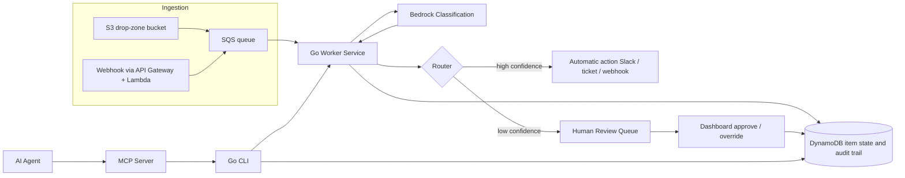
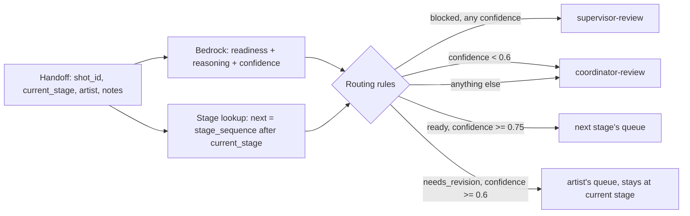

# Ingest → Classify → Route (ICR) Pipeline: Reference Architecture

## Purpose

This system is a generic, reusable pattern for a problem almost every
mid-market company has, even if they've never described it this way:
something arrives, a person has to read it and decide what happens next,
and that deciding step is manual, inconsistent, and the first thing that
breaks under volume.

Each instance of this repo serves three purposes at once:

- **A public demo** — proof of hands-on Go + AWS + applied-LLM engineering.
- **Course material** — the worked example for *From Go CLI to AI Agent*,
 showing the actual arc from a plain CLI to an agent-operable one.
- **A consulting demo** — a single build that gets reframed per prospect
 rather than rebuilt from scratch each time.

Because it's reframed per prospect and shown publicly, **no real client or
personal data ever goes in this repo.** All demo data is synthetic.

## The Problem Pattern

```
 something arrives -> someone decides what it is and what to do with it -> it gets handled
 (ticket, (currently: manual, (currently:
 alert, inconsistent, inconsistent,
 document, doesn't scale) undocumented)
 handoff)
```

Same pipeline shape, different classification prompt and routing rules per
prospect — that's the whole point of building it generically instead of
vertically.

## High-Level Architecture



## Components

**1. Ingestion.** Two entry points feed one queue: an S3 drop-zone bucket
for anything file-based (S3 event notifications push new-object events onto
the queue), and an API Gateway + Lambda webhook receiver for anything
event-based. Both normalize into the same message shape on SQS.

**2. Worker (Go).** Consumes the queue; for each item, pulls the raw content,
normalizes it, calls the classification step, writes the result to the
state store, hands the classified item to the router.

**3. Classification (AWS Bedrock).** A single, bounded call — not a
chatbot. Structured prompt in, structured JSON out:
`{category, priority, summary, confidence}`. Low confidence is a first-class
outcome, not an error — it's what routes an item to a human instead of
guessing.

**4. State Store (DynamoDB).** Every item's full lifecycle is recorded:
received -> classified -> routed -> actioned, with timestamps and the
model's reasoning attached at each step. This audit trail is often the
actual thing a compliance-minded buyer is paying for.

**5. Router.** A small rules-driven layer, not hardcoded branching logic.
High confidence + known category -> automatic action. Low confidence, or a
category marked always-review -> human review queue.

**6. Dashboard (Go web service).** Shows the human review queue: item
detail, the model's classification and confidence, and an approve/override
control — the human-in-the-loop layer.

**7. CLI (Go).** The same core operations exposed as a standalone CLI:
`ingest`, `classify`, `route`, `status`. The direct descendant of the
existing *Modern Go CLI* book/course.

**8. MCP Server (agent-ready layer).** Wraps the CLI's commands as MCP
tools so an AI agent can operate the pipeline the same way a human would.
Read tools (`status`, `get-item`, `list-queue`) are always available;
write/routing tools (`route-item`, `reclassify`, `approve`) are scoped,
logged, and require an explicit permission flag. No implicit write access.

**9. Infrastructure as Code (AWS SAM).** S3, SQS, DynamoDB, API Gateway, the
Lambda worker, and Bedrock IAM permissions are all defined in a single AWS
SAM template (`infra/template.yaml`). SAM was picked over Terraform/CDK
because this pipeline is almost entirely event-driven Lambda — exactly the
shape SAM was built for, with native local testing (`sam local invoke`,
`sam local start-api`).

## Safety & Data Handling

- No real client or personal data in this repo, ever — synthetic fixtures
 only.
- Every automatic (non-reviewed) action is logged with the classification
 reasoning that triggered it.
- MCP write/routing tools are opt-in and scoped, never on by default.
- Low-confidence classification routes to a human by design.

## Repo Structure

```
/cmd
 /cli -> the CLI binary (ingest, classify, route, status)
 /worker -> the SQS consumer / worker service
 /dashboard -> the review-queue web service
/internal
 /classify -> Bedrock client + prompt templates (+ mock fallback)
 /store -> DynamoDB access layer (+ local/in-memory fallback)
 /router -> routing rules engine
 /mcp -> MCP server wrapping the CLI as agent tools
/infra
 template.yaml -> AWS SAM template
 samconfig.toml -> SAM CLI deployment config
/demo -> synthetic fixtures and sample data for demos
README.md
ARCHITECTURE.md -> this file
```

## Reframing Notes

When pitching this to a specific prospect, only three things change: the
classification prompt, the routing rules, and the demo fixtures. The
ingestion, worker, state, dashboard, CLI, and MCP layers stay identical.
That's the reusability this whole architecture is built around.

## This instance: Amberlight Animation (shot handoff triage)

Amberlight Animation is a **fictional** mid-size episodic animation studio
(~280 employees). Shots move through a fixed pipeline of departments. When an
artist finishes their stage, a production coordinator reads the handoff note
and decides by hand whether the shot is ready to move on, needs another pass,
or is blocked. That check is the step that breaks first as a show scales up.

### Design point: stage sequencing is configuration, not a model decision

The pipeline order is a fixed, known list in `config/amberlight.yaml`:

```yaml
pipeline:
  stage_sequence: [storyboard, layout, animation, lighting, compositing]
  final_destination: delivered
```

Responsibilities are split deliberately:

| Question | Who answers it | How |
|---|---|---|
| Which stage did the artist just finish? | The submitter (production tracker, form, person) | `current_stage` is plain metadata on every handoff (`shot_id`, `current_stage`, `artist`, `episode`, `notes`). It is never inferred. Ingest rejects any stage not in the sequence. |
| Is the shot ready, does it need revision, or is it blocked? | The model (one bounded Bedrock call) | Judged from the unstructured `notes` only. Output: `{readiness, reasoning, confidence}`. There is **no** `target_stage` field — the model is told not to produce one, and the parser has nowhere to put it if it does. |
| If it moves, where to? | The router | `NextStage(current_stage)`: a deterministic lookup of whatever immediately follows `current_stage` in `stage_sequence`, or `delivered` after the last stage. Pinned by unit tests for every stage, including the end of the sequence. |

So a model cannot skip a department, send a shot backwards, or invent a
stage, and changing the studio's pipeline order is a one-line config change
that needs no prompt change and no retraining.



### Inputs customized for Amberlight

| Input | Amberlight value |
|---|---|
| Items | Shot handoff events (`demo/handoffs/*.json`) |
| Classification output | `readiness` (`ready_for_next_stage`, `needs_revision`, `blocked`), `reasoning` (one to two sentences), `confidence` — no category/priority, no stage |
| Stage order | `storyboard → layout → animation → lighting → compositing → delivered` |

| Rule (first match wins) | Condition | Destination |
|---|---|---|
| `blocked-escalate` | readiness = blocked, **any** confidence | `supervisor-review` + notify `#amberlight-supervisors` |
| `low-confidence` | confidence < 0.6 (and not blocked) | `coordinator-review` |
| `auto-advance` | ready_for_next_stage, confidence ≥ 0.75 | the looked-up next stage's queue (e.g. `lighting`, or `delivered`) + tracker update + notify `#amberlight-<next stage>` |
| `return-to-artist` | needs_revision, confidence ≥ 0.6 | `artist:<name>` with the reasoning attached; the shot stays at its current stage |
| default | anything else (e.g. ready at 0.60–0.74) | `coordinator-review` |

Human review: a coordinator or supervisor can approve the verdict or override
the readiness. Human-verified items skip the confidence gates (a confirmed
"ready" advances, a confirmed revision goes back to the artist, a confirmed
block is parked in `on-hold`). The next stage still comes from the lookup.

The rules live in `config/amberlight.yaml` → `routing`; fixtures in
`demo/handoffs/` with their intended outcomes in `demo/expected.json`.
`compare/` runs a naive keyword-rules classifier next to Bedrock on the same
fixtures to show where keyword matching breaks down.

This is the same code as the `rivergate-icr-pipeline` support-ticket
instance: ingestion, queue, worker, store, dashboard, CLI, MCP and SAM
template are unchanged in shape. What changed is the prompt, the routing
rules (plus the stage lookup they use) and the fixtures.
